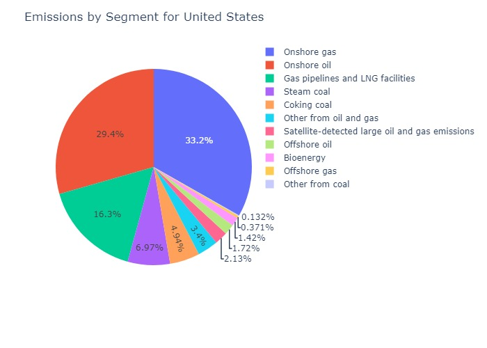
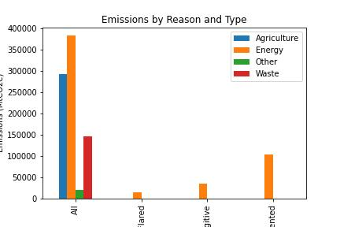

# Methane Emissions Analysis

The purpose of this project is to analyze and visualize data on methane emissions by country, segment, type, reason, and year. Methane is a potent greenhouse gas that contributes to climate change, and understanding its sources and patterns of emission is crucial for developing effective mitigation strategies. The project uses Python libraries such as pandas, numpy, matplotlib, seaborn, and plotly to perform the analysis and create visualizations.

The data was first read in using the pandas library and checked for missing values and data types. Descriptive statistics were then computed to gain an overview of the data. The data was then grouped by country to calculate total emissions for each country. The 'World' row was filtered out from the total emissions dataframe to remove this outlier. Bar charts and treemap visualizations were created to show the top and bottom countries by emissions. The data was then grouped by segment, type, reason, and year for the United States, and pie charts, horizontal bar charts, and a line chart were created to visualize the data.

To view the Analysis, click [here](./EmissionsEDA.ipynb).

---

## Dependencies
This code requires the following Python libraries to be installed:

    - numpy

    - pandas

    - matplotlib

    - plotly

    - seaborn

---

## Data
The code reads in a csv file named "Methane.csv" located in the "./Resources" directory.

**Context**

Methane is responsible for around 30% of the rise in global temperatures since the Industrial Revolution, and rapid and sustained reductions in methane emissions are key to limiting near-term global warming and improving air quality. The energy sector – including oil, natural gas, coal and bioenergy – accounts for nearly 40% of methane emissions from human activity.

**Content**

The following dataset has information about methane gas emissions globally. Details about the columns are as follows:

region -

country - Country of Emission.

emissions - Methane Emissions in kt.

type - Sector from which emissions occur.

Segment- Sub-sector from which emissions occur.

reason - The reason for the emission.

baseYear - Base year for the tracking of emissions.

notes - The source of data

---

## Methodology and Analysis

**Grouping and Calculation of Emissions by Country**

To calculate the total emissions by country, the data was first grouped by country using the groupby() method in pandas. Then, the sum() method was used to calculate the total emissions for each country. The resulting dataframe included the total emissions for each country, as well as the emissions by segment, type, and reason.

To filter out the 'World' row from the total emissions dataframe, the drop() method was used with the label 'World' as the argument. This removed the row with the 'World' label from the dataframe, leaving only the rows corresponding to individual countries.

The resulting dataframe was then used to create a horizontal bar chart and treemap visualization of the total emissions by country.

**Grouping and Calculation of Emissions by Segment, Type, and Reason**

To calculate the emissions by segment, type, and reason for the United States, the data was first filtered to include only the rows corresponding to the United States using boolean indexing. Then, the data was grouped by segment, type, and reason using the groupby() method. The sum() method was used to calculate the emissions for each segment, type, and reason.

The resulting dataframes were then used to create a pie chart showing the percentage of emissions by segment, a horizontal bar chart showing the emissions by type, and a pie chart showing the percentage of emissions by reason.

**Grouping and Calculation of Emissions by Year**

To calculate the emissions over time for the United States, the data was again filtered to include only the rows corresponding to the United States. Then, the data was grouped by year using the groupby() method. The sum() method was used to calculate the emissions for each year.

The resulting dataframe was then used to create a line chart showing the emissions over time.

Overall, the grouping and calculation of emissions by country, segment, type, reason, and year allowed for a more detailed analysis of the methane emissions data, highlighting important patterns and trends in emissions across different variables.

---

## Summary Statistics
The code outputs descriptive statistics for the methane emissions data including data types, missing values, and total emissions by country.

## Visualizations
The code produces the following visualizations:

**Total Emissions**
- A horizontal bar chart showing the total emissions by country.

- A treemap visualization showing the total emissions by country.

**Emissions by Segment**
- A pie chart showing the percentage of emissions by segment for the United States.

**Emissions by Type**
- A horizontal bar chart showing the emissions by type for the United States.

**Emissions by Reason**
- A pie chart showing the percentage of emissions by reason for the United States.

**Emissions over Time**
A line chart showing the emissions over time for the United States.

**Regional Emissions**
A horizontal bar chart showing the total emissions by region.

**Emissions by Country**

**Emissions by Country and Segment**
A bubble chart showing the emissions by country and segment.

**Average Emissions by Year**
- A line chart showing the average emissions by year.

- A bar chart for emissions by year

**Emissions by Reason and Type**
A stacked bar chart showing the emissions by reason and type for United States.

**Emissions by Type and Segment**
A stacked bar chart showing emissions by type and segment.

**Emissions by Region and Segment**

**Emissions by Country and Year**
3 filtered line charts showing the increase and decrease in emissions as well as the total.

**Emissions by Type and Reason**
A grouped bar chart showing emissions by type and reason.

**Emissions by Region and Type**
A stacked bar chart to display the emissions by region and type.

**Emissions by Country and Segment**
Two separate visualizations, one for top emissions and one for bottom emissions

**Emissions by Reason and Type**
- A stacked bar chart to display the emissions by reason and type

- A grouped barchart to display the emissions by reason and type

---

## How to Use

To use this code, simply run the code in a Python environment with the required dependencies installed and with the "Methane.csv" file located in the "./Resources" directory. The visualizations and summary statistics will be outputted in the console.

---

## High-level Walkthrough

**The code performs the following tasks:**

- Read the Methane.csv file and stores the data in a Pandas dataframe.

- Check the data types of the dataframe columns.

- Check the dataframe for missing values.

- Compute and prints the descriptive statistics of the dataframe.

- Group the dataframe by country and calculates the total emissions for each country.

- Filter out the 'World' row from the total emissions dataframe.

- Create two separate bar charts for the top 8 and bottom 20 countries by emissions.

- Create a treemap visualization for the total emissions by country.

- Group the dataframe by segment and calculates the emissions for each segment in the United States.

- Create a pie chart showing the percentage of emissions by segment for the United States.

- Group the dataframe by type and calculates the emissions for each type in the United States.

- Create a horizontal bar chart showing the emissions by type for the United States.

- Group the dataframe by reason and calculates the emissions for each reason in the United States.

- Create a pie chart showing the percentage of emissions by reason for the United States.

- Group the dataframe by year and calculates the emissions for each year in the United States.

- Create a line chart showing the emissions over time for the United States.

---

## Results

The analysis revealed that the top emitters of methane are largely developed countries with high levels of industrial activity, such as the United States, China, and Russia. The bottom emitters are predominantly developing countries with lower levels of industrialization. The pie chart of emissions by segment for the United States showed that the largest source of emissions is the energy sector, followed by agriculture and waste. The horizontal bar chart of emissions by type showed that the largest source of emissions is enteric fermentation, which is a natural digestive process in animals. The pie chart of emissions by reason showed that the largest source of emissions is production and consumption of energy, followed by agriculture and waste. The line chart of emissions over time for the United States showed that emissions have been declining, which is likely due to increased regulation and the adoption of cleaner technologies.

---

## Conclusion

The analysis of methane emissions data has revealed several key findings that have important implications for policy and mitigation efforts. First, the study found that industrial activity and agriculture are the primary drivers of methane emissions globally. Second, there is significant variation in emissions levels across countries and regions, with some countries experiencing much higher emissions rates than others. Third, the United States has shown a declining trend in methane emissions in recent years, but this trend needs to be sustained and expanded globally to make a meaningful impact on overall emissions levels.

These findings highlight the urgent need for more effective policy and mitigation strategies that target the primary sources of methane emissions. Specifically, efforts should focus on reducing emissions from the industrial and agricultural sectors through improved technologies, practices, and regulations. Additionally, more investment is needed in research and development to identify new ways to reduce methane emissions and improve monitoring and reporting systems.

Overall, the project underscores the critical role that data analysis and visualization can play in understanding complex environmental issues and developing evidence-based solutions. By leveraging the power of data, we can make informed decisions and take targeted actions to address one of the most pressing environmental challenges of our time.
